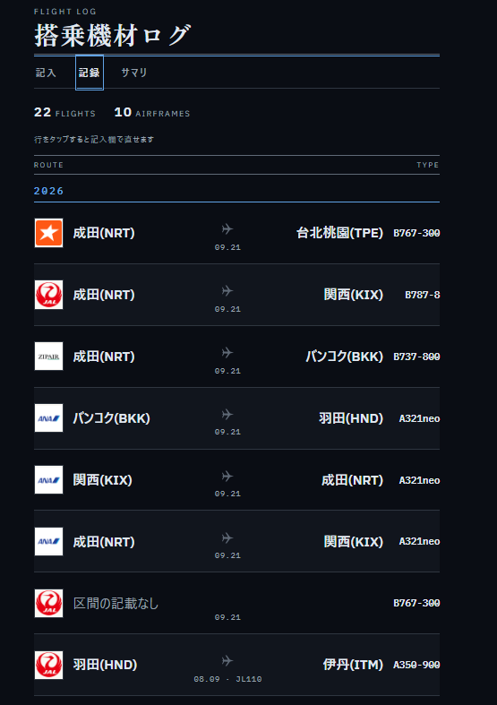
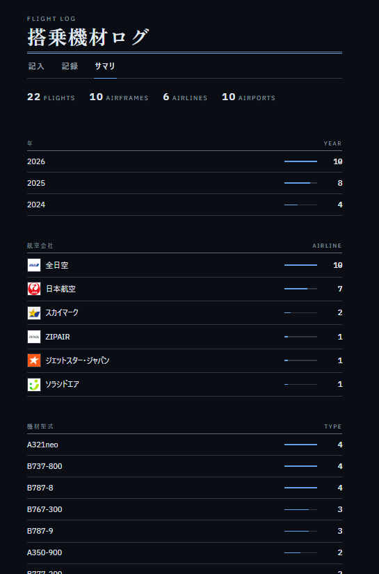
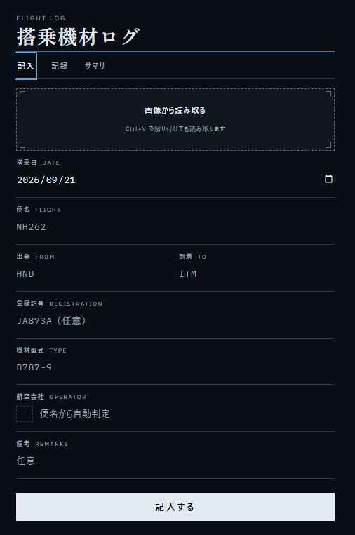

# 搭乗機材ログ

自分が搭乗した飛行機の機材を記録する個人用アプリ。Google Apps Script + スプレッドシート製。

**どの区間に、どの航空会社の、どの型式で乗ったか**を残すのが主目的。
登録記号も書けるが任意で、書けば次から型式と航空会社が自動で埋まる。

| 記録 | サマリ | 記入 |
|:--:|:--:|:--:|
|  |  |  |

## 構成

```
docs/                 GitHub Pages で公開する器と、README 用の画像
├── index.html        /exec を iframe で開くだけのページ（下記「バナーを消す」）
src/
├── appsscript.json   マニフェスト（タイムゾーン・Drive API・ウェブアプリ設定）
├── Constants.js      シート名・列定義・航空会社/空港/機材型式の対照表
├── Sheets.js         スプレッドシートへのアクセス層
├── Code.js           doGet と画面から呼ぶ API
├── index.html        スマホ用の画面（HTML/CSS/JS 一体）
├── Ocr.js            画像から搭乗情報を読み取る（入口とドライブの OCR）
├── Gemini.js         画像読み取りの Gemini 版（キーがあれば優先される）
├── Logos.js          航空会社ロゴの取得（一度だけ外部から取り、以後は自前）
└── DevSeed.js        動作確認用のサンプルデータ投入（本運用前に削除してよい）
```

データはスプレッドシートの 2 シートに入る。

| シート | 内容 |
|---|---|
| `flights` | 搭乗ログ。1 行 = 1 フライト |
| `aircraft` | 機体マスタ。登録記号 → 型式・航空会社 |
| `airlines` | 航空会社のロゴ。コード → 画像（base64 か URL） |

`aircraft` は「登録記号 → 型式・航空会社」の対照表であって、搭乗の記録ではない。
記入の補完にだけ使う。同じ機体に何回乗ったかは数えていない。

## セットアップ

1. Google ドライブで新規スプレッドシートを作成し、名前を `flight_log` にする
2. **拡張機能 > Apps Script** を開く
3. 左の「ファイル」に、`src/` の中身を同じ内容で作る
   - `Code.gs` ← `src/Code.js`
   - `Sheets.gs` ← `src/Sheets.js`（＋ボタン > スクリプト）
   - `Constants.gs` ← `src/Constants.js`（＋ボタン > スクリプト）
   - `Ocr.gs` ← `src/Ocr.js`（＋ボタン > スクリプト）
   - `Gemini.gs` ← `src/Gemini.js`（＋ボタン > スクリプト）
   - `Logos.gs` ← `src/Logos.js`（＋ボタン > スクリプト）
   - `index.html` ← `src/index.html`（＋ボタン > HTML）
   - `DevSeed.gs` ← `src/DevSeed.js`（動作確認用。不要なら貼らなくてよい）
   - 最初からある `コード.gs` は `Code.gs` にリネームして中身を差し替えればよい
4. 左メニューの **サービス** の「＋」から **Drive API** を追加する（バージョン v3）
   - 画像読み取りに使う。追加しないと `Drive is not defined` で止まる
5. 関数の選択欄で `setup` を選び **実行**。初回は承認ダイアログが出るので許可する
   - `flights` と `aircraft` シートが生成される
   - 画像読み取りを追加したことでドライブへの権限が増えたため、
     既に動かしている場合もここで再承認を求められる
6. **デプロイ > 新しいデプロイ > 種類の選択 > ウェブアプリ**
   - 次のユーザーとして実行: **自分**
   - アクセスできるユーザー: **全員**（ログイン不要。URL を知っていれば開ける）
     - 「Google アカウントを持つ全員」ではない。あちらはログインが要る
     - `executeAs` は「自分」のままなので、開いた人は全員こちらの権限で動く。
       つまり URL を知った人は誰でもログの閲覧と書き込みができる
     - 設定を変えるときは **デプロイを管理 > 鉛筆** から編集する。
       「新しいデプロイ」だと URL が変わり、ホーム画面のショートカットが切れる
7. 発行された URL をスマホで開き、ブラウザのメニューから **ホーム画面に追加**

### 航空会社のロゴ

台帳の各行の左端に航空会社のロゴを出す。ロゴが無い会社は 2 レターコードの枠で出る。

`fetchAirlineLogos()` を一度実行すると、搭乗履歴に出てくる会社のロゴをまとめて取得し、
base64 で `airlines` シートに保存する。**以降は外部を参照しない**ので、配信元が止まっても
レート制限をかけても表示は壊れない。新しい会社に乗ったときは保存時に自動で取りに行く。

#### ロゴが入るタイミング

**便名か航空会社を入れてフォーカスを外した時点**で、その会社のロゴを取りに行く。
保存を待たなくてよい。保存時にも取りに行くが、これは画像読み取りで値が
自動入力された場合（`change` が発火しない）の保険。

会社コードは便名を優先し、無ければ航空会社名から `AIRLINE_CODES` を逆引きする。
**便名を入れずに航空会社だけ書く記入が普通にあるため**、便名だけに頼らない。

航空会社欄の左にロゴ枠が出る。

| 枠の見え方 | 意味 |
|---|---|
| 点線・`—` | 便名がまだ無い。紐づける会社が決まらないので押せない |
| 実線・コード | 会社は決まったがロゴが無い |
| 実線・ロゴ | ロゴがある |

**枠をタップすると手元の画像を選んで差し替えられる。** 取得元にロゴが無いときや、
取れたロゴがおかしいときの逃げ道。画像は PNG・長辺 128px に縮小して保存する。

PNG なのは透過を保つため。**JPEG には透過が無く、透過部分が黒く塗られる。**
搭乗券の読み取りは JPEG のままでよいので、出力形式は呼び出し側で切り替えている。

#### シートを直接いじる場合

通常は上の航空会社タブで足りる。以下はシートの仕様。

`logo` 列は 3 通りに読み分ける。

| logo 列 | 意味 |
|---|---|
| 空 | まだ取っていない。次の保存時に取りに行く |
| `-` | この会社はコード表示でよい。二度と取りに行かない |
| `data:…` / `https:…` | このロゴを使う |

自動でロゴを取りに行くのは**フライトを保存した瞬間だけ**で、しかもその便名から取れた
会社に対してだけ。**シートに行を足しても、それだけでは誰も取りに行かない。**
先に入れておきたいときは航空会社タブでタップするか、`fetchAirlineLogos()` を実行する
（`logo` 列が空の行も拾うようにしてある）。

変なロゴが付いた会社は、セルを空にするのではなく **`-` を書く**
（空にすると「まだ取っていない」とみなして取り直してしまう）。航空会社タブで
タップして外せば `-` が自動で入るので、通常は手で書く必要はない。

確認はウェブアプリの台帳で行う。base64 はセル上では画像として見えないし、取得元は
存在しないコードでも 404 を返さずコードごとの生成画像を返すため、シートを見ても
「ロゴが無い」は判別できない。

実測で分かっている癖がひとつある。**NU（日本トランスオーシャン航空）は JAL のロゴが返る。**
JAL グループなので妥当とも言えるが、気になるなら消す。

取得元を変えるときは `src/Constants.js` の `AIRLINE_LOGO_URL` 一行だけ直す。

### Gemini を使う場合（任意）

設定しなくてもドライブの OCR で動く。精度を上げたいときだけでよい。

1. [Google AI Studio](https://aistudio.google.com/apikey) で API キーを発行する
2. GAS エディタの **プロジェクトの設定 > スクリプト プロパティ** で
   `GEMINI_API_KEY` という名前でキーを保存する
3. GAS エディタで **`checkScanEngine` を実行**し、承認ダイアログを許可する
   - `UrlFetchApp` を使うコードを後から足したため、それ以前の承認には
     外部リクエストの権限が含まれておらず、通しておかないと
     `UrlFetchApp.fetch を呼び出す権限がありません` になる
   - 実行ログにどちらの方式が使われるか、キーが生きているかが出る
4. ウェブアプリを開き直す。まだ OCR に落ちる場合はデプロイを新バージョンで更新する

キーはスクリプトプロパティに置くので、ソースにも Git にも入らない。
モデル名を変えるときは `src/Gemini.js` の `GEMINI_MODEL` を直す。

`src/appsscript.json` の内容はマニフェストに対応する。エディタで見たい場合は
**プロジェクトの設定 >「appsscript.json マニフェスト ファイルをエディタで表示する」**を ON にする。
手順 4 と 6 を画面から行えば同じ内容が書かれるので、必須ではない。

## 使い方

画面は「記入」「記録」「サマリ」の 3 タブ。

1. 便名を入れると航空会社が自動判定され、過去に同じ便名で飛んでいれば区間も埋まる
2. 登録記号（任意）を入れると、機体マスタか過去の履歴から型式と航空会社が埋まる
3. 保存

「記録」タブには全件が搭乗日の新しい順に並ぶ。年ごとに見出しが入り、
上部に総フライト数が出る。

行は 2 列。左にロゴ、右に区間。日付・便名・型式は空港名の下に 1 行でまとめる。

```
[ANA]  成田(NRT)        ✈        関西(KIX)
          09.21 · JL123 · B787-9
```

補足の行は飛行機の真下（中央寄せ）。航空会社名は書かない。左端のロゴが
同じことを言っているため。ただしロゴも符号も出せない行だけは名前を残す。

型式は右端の独立した列ではなく、この補足の行に並べる。右端に置くと
型式の文字数で列幅が変わり、区間に使える幅が行ごとに変動した。
日付・便名と同じ行に流せば列が 1 つ減り、そのぶん区間が広く使える。
登録記号は出さないがシートには入る。

行の要素は**空港名の 1 行目を基準の線として揃える。** ロゴも飛行機も、
空港名 1 行分の高さの箱に入れて中で中央に置く。行の中央に揃えると、
空港名が折り返した行だけ段の間へ落ちる。

区間は**出発と到着を両端へ振り、間に飛行機を置く。**
左右を同じ幅の列にしてあるので、**飛行機は行をまたいで必ず同じ位置に並ぶ。**
伸縮させると両側の空港名の長さで位置が動き、行ごとに左右へばらつく。
空港名は長さがまちまち（`羽田(HND)` と `台北桃園(TPE)`）なので、
列に収まらなければ折り返す。片側しか無い記録では飛行機を出さない。

飛行機は自前の SVG。絵文字は端末ごとに形も向きも変わるので使わない。
形の定義は `<symbol id="ic-plane">` に 1 回だけ置き、各行は `<use>` で参照する。

360px 未満では長い空港名（`台北桃園(TPE)` など）が折り返すので、
その幅でだけ空港名を一段小さくする。

### サマリ

「サマリ」タブは記録と同じデータから集計する。サーバに数えさせないのは、
材料が既に画面の手元にあるのに往復を増やす理由が無いため。

| 段 | 内容 |
|---|---|
| 合計 | フライト数 / 機体数（登録記号のユニーク） / 航空会社数 / 空港数 |
| 年 | 新しい順。ここだけは多い順にしない。並びそのものが意味を持つ |
| 航空会社 | 多い順。左に記録と同じロゴ（無ければ 2 レターコードの枠） |
| 機材型式 | 多い順 |
| 空港 | 多い順。出発と到着の両方を数える。上位 15 件で、残りは件数だけ |

各行には比を持たせた棒が付く。数を読まなくても多い少ないが分かる。
航空会社は**コードで束ねる**ので、同じ会社を和名で書き分けても 1 社に寄る。

### Google のバナーを消す

`/exec` を直接開くと、Google が上に帯を出す。

> このアプリケーションは Google Apps Script のユーザーによって作成されたものです

あれは**自分の HTML の外側**にある Google のページが描いている。ウェブアプリは
Google のページの中にサンドボックス化された iframe として置かれる構造で、
バナーはその外側に属する。オリジンが違うので CSS も JS も届かず、
Google 側にも消す設定は無い。

最上位を自分のページにすれば、Google のラッパーを経由しないので出ない。
`docs/index.html` がその器で、`/exec` を全画面の iframe で開くだけのもの。

**設置**

1. `doGet()` の `setXFrameOptionsMode(ALLOWALL)` が入った `Code.gs` を貼り、
   デプロイを新しいバージョンで更新する。これが無いと既定の `SAMEORIGIN` で
   弾かれ、iframe が真っ白になる
2. GitHub の **Settings → Pages** で、Source を `Deploy from a branch`、
   Branch を `main` / `/docs` にする
3. 数分後 `https://<ユーザー名>.github.io/flight-log/` が開く
4. **末尾に `#` とウェブアプリ URL を付けて一度だけ開く**

```
https://<ユーザー名>.github.io/flight-log/#https://script.google.com/macros/s/.../exec
```

以後はこの端末が覚えるので、`#` 無しでも開く。

**なぜ URL をリポジトリに書かないか**

このアプリには認証が無く、**URL を知らないことだけが保護**になっている。
`docs/index.html` に URL を書くと、そのページは公開されるので、
辿り着いた誰もが搭乗記録を追加・編集・削除できてしまう。記録は元に戻せない。

そこで URL は端末側にだけ置く。`#` から受け取って `localStorage` に覚え、
リポジトリにも公開ページにも残さない。`#` の中身は他人から送りつけられる
余地があるので、`script.google.com/macros/s/…/exec` の形だけを通す。

**ホーム画面に追加すると全画面で起動する**

自分のページなので `apple-mobile-web-app-capable` を置いてある。iPhone で
ホーム画面に追加すると、Safari のアドレスバーもタブバーも出ない。
**追加するときは `#` 付きの URL のまま行うこと。** Safari が保存を消しても
開けるようにするため。

**引き換えになるもの**

- `ALLOWALL` にすると、誰でもこのアプリを自分のサイトへ埋め込めるようになる
- 経路が 1 つ増える。GitHub Pages が落ちるとアプリも開けない

**記録の操作はすべてスマホで完結する。スプレッドシートを開く必要はない。**

- **行の本体をタップ** → その記録が記入欄に読み込まれ、編集に入る。
  上部に「◯◯ を編集中」が出て、ボタンが「記入を直す」に変わる。やめるときは「やめる」
- **編集中の「削除」** → その記録を消す。**2 段階**で、1 回目は「本当に削除する」に
  変わるだけ。5 秒触らなければ元に戻る。消した記録は戻せない
  - ネイティブの `confirm()` は使っていない。GAS のサンドボックス iframe で
    出ない恐れがあり、「押しても何も起きない」が最悪なため
  - `aircraft` の行は残すが、あれは登録記号のマスタであって搭乗の記録ではない
- **左端の印をタップ** → ロゴの入切。ロゴがあれば外し、無ければ取りに行く。
  押すたびに入れ替わるので、確認も取り消しも要らない

各入力欄は**過去に入力した値を先に、続けて対照表の全件**を候補に出す。
よく乗るものが上に来つつ、まだ乗っていない会社や機材も選べる。

- 航空会社 — `AIRLINE_CODES`（32 社）
- 出発・到着 — `AIRPORT_NAMES`（163 空港）。**`羽田` や `鹿児` のように日本語でも引ける**
- 機材型式 — `AIRCRAFT_TYPES`（30 型式）
- 便名・登録記号 — 過去の入力のみ（対照表を作れる性質のものではないため）

どれも対照表に無い値をそのまま手入力でき、一度入力すれば次から候補に加わる。

候補は `datalist` ではなく自前で描いている。iOS の Safari は `datalist` を
まともに表示せず、候補が出ないか、キーボード上部の細いバーに出るだけのため。

選択は `click` で拾っている。`touchstart` で拾うと指が触れた瞬間に確定してしまい、
リストをスクロールすることもできなくなる。`click` なら指が動いたとき（スクロール）は
発火しない。閉じるのも blur ではなく「候補の外側を触ったか」で判断している。
blur で閉じると、リストをスクロールしただけで消えてしまうため。


必須は**搭乗日・出発・到着**の 3 つ。未入力のまま保存しようとすると
赤枠と注意書きが出て、最初の未入力欄へ移動する。便名・登録記号・機材型式・航空会社・メモは任意。

登録記号は任意にしてある。分からないまま記録したい場面があるため。

ブラウザ任せの検証（`required` の吹き出し）は使っていない。iOS の Safari は
`required` で送信を止めるのに吹き出しを出さず、「保存を押しても何も起きない」
という見え方になるため。フォームには `novalidate` を付けてある。
`saveFlight` 側でも同じ項目を確かめている。
機体マスタは空の状態から始まり、乗るたびに育つ。2 回目以降は登録記号を打つだけで型式が埋まる。

### 画像から読み取る

「📷 画像から読み取る」で搭乗券や航空会社アプリの画面を選ぶと、読み取れた項目が
**空欄のフィールドだけ**に入る。手で直した内容は上書きしない。
登録記号が読めた場合は、そのまま型式と航空会社の補完も走る。

画像の渡し方は 2 通り。

- **ボタンから選ぶ** — スマホならカメラと写真ライブラリの両方が開く
- **Ctrl+V で貼り付ける** — Snipping Tool で撮った直後にそのまま流せる。
  ページのどこかを一度クリックしてから貼る（ウェブアプリは iframe の中で動くため、
  画面に触れていないと貼り付けイベントが届かない）

クリップボードに画像が無いときは普通の貼り付けとして扱うので、
入力欄へのテキスト貼り付けは邪魔されない。

読み取りは 2 通りあり、**スクリプトプロパティの `GEMINI_API_KEY` の有無で自動的に切り替わる**。

| | ドライブの OCR（既定） | Gemini |
|---|---|---|
| 条件 | 何もしなくても使える | `GEMINI_API_KEY` を設定 |
| 費用 | 完全無料・回数制限なし | 無料枠あり（レート制限あり） |
| 仕組み | 文字を読み、`src/Ocr.js` の正規表現で抽出 | 画像を解釈して JSON を直接生成 |
| 崩れたレイアウト | 弱い | 強い |
| 表にない航空会社 | 拾えない | 推測できる |
| 画像の行き先 | 自分のドライブ内で完結 | Google の API |

**Gemini が失敗したら自動で OCR に降りる。** レート制限に当たっても読み取りは止まらず、
その場合は画面に理由が出る。どちらで読んだかは結果の先頭のバッジで分かる。

ドライブの OCR は、画像を Google ドキュメントに変換すると OCR が走る仕組みを使っている。
変換に使った一時ファイルはその場で削除している。
読めるのは印字された文字だけなので、向いているのは搭乗券・レシート・アプリの画面。
機体の写真から登録記号を読むのは不得手。

搭乗券には氏名・予約番号・マイレージ番号が載っている。
ドライブの OCR なら自分のドライブ内で完結するが、Gemini では画像が外部に出る。
無料枠のデータの扱いは [ai.google.dev/pricing](https://ai.google.dev/pricing) を確認のこと。

誤読したときは「読み取ったテキスト」を開くと OCR の生の出力が見られる。
抽出の規則は `src/Ocr.js` にあり、GAS エディタから `testExtract` を実行すると
画像なしでテキストだけで抽出を試せる。

拾えるのは次のとおり。

| 項目 | 拾い方 |
|---|---|
| 搭乗日 | `2026年9月21日` / `2026/09/21` / `21SEP26`。年の無い表記は今年とみなす |
| 便名 | 頭 2 文字が `AIRLINE_CODES` にあるものだけ。搭乗券は数字が多く、誤認を避けるため |
| 航空会社 | 便名から自動判定 |
| 出発・到着 | 3 レターコードと日本語名（羽田 等）の両方。現れた順の最初の 2 つ |
| 登録記号 | 日本籍（`JA` + 英数 4 文字）のみ。海外籍は手入力 |
| 機材型式 | `BOEING 787-9` / `B787-9` / `A350-900` を `B787-9` 形式に寄せる |

航空会社の自動判定に使うコード表は `src/Constants.js` の `AIRLINE_CODES` にある。
表にない会社に乗ったらここに 1 行足す。足さなくても手入力で普通に記録できる。

空港名の対照表は同じファイルの `AIRPORT_NAMES`。画面では「羽田(HND)」のように併記される。
表にないコードは 3 レターのまま表示されるだけで、記録には影響しない。

## デザイン

飛行記録簿（ログブック）の書式を下敷きにしている。角丸をゼロに固定し、
枠で囲うのをやめて罫線だけで構造を作る。数字と符号は等幅で桁を揃える。

- マクロ構造は Index-First — ページそのものが台帳で、行は罫線で区切る。リビール演出は置かない
- 書体は 3 つ。見出し Zen Old Mincho / 本文 IBM Plex Sans / 数字と符号 IBM Plex Mono
  - 日本語は端末の明朝・ゴシックに落ちる。欧文だけ Web フォントを読むので CJK の重い読み込みが無い
  - iPhone の和文は iOS 標準のヒラギノ角ゴシックが出る。和文の Web フォントは
    全字種で数 MB になるので読まない
- 文字サイズは 12 / 14 / 16 / 18 / 28px の 5 段階。**12px を下限とする**
  - iOS の Caption 1 と同じ。これ未満は Apple も補助的な注記にしか使わない
  - 16px は iOS で入力欄が勝手に拡大されない下限でもある
  - 段階の外に直値を置かない。散らすと次に全体を調整するとき取りこぼす
- 紙はクリーム地のまま、その上に引かれるもの（罫・文字）は青黒へ寄せている
  - 主色はインク青。罫・見出し・活性の目印はすべてこれ
  - 赤は「注意・訂正・合計」だけに退く。未記入の印がこれ
  - 台帳で赤が担う役割をそのまま当てているので、赤が出たときだけ目を引く
- 航空会社は 2 レターコードを枠で囲った符号として各行の左端に出す
  - 実物のロゴは商標で持ち込めず、台帳の語彙にも符号のほうが合う
  - `AIRLINE_CODES` に無い会社でも便名から取れるので必ず出る
- 入力欄は箱ではなく罫線。フォーカスすると行の罫が赤くなる

トークンの定義は `src/index.html` の `<style>` 冒頭だけにある。
GAS の HtmlService は外部 CSS を配信できないので、別ファイルに切り出しても
手で同期するしかなく、実際にズレる。控えは置かない。

この設計は [Hallmark](https://github.com/Nutlope/hallmark) スキルの手順に沿って作った。
判断の記録は `.hallmark/log.json`、`src/index.html` 冒頭のスタンプにある。

## コードを直したとき

現状は GAS エディタへのコピペ運用。ソースはこのリポジトリが正で、GAS 側は写し。
**直したら必ずこちらを先に直してから GAS に貼る。**

往復が面倒になったら clasp（Google 公式 CLI）を導入できる。必要なのは node だけ。

```bash
npm i -g @google/clasp
clasp login
# https://script.google.com/home/usersettings で Apps Script API を ON にする
# （忘れると User has not enabled the Apps Script API で止まる）
```

`.clasp.json` を手で作る。スクリプト ID は Apps Script の**プロジェクトの設定**にある。

```json
{ "scriptId": "<スクリプトID>", "rootDir": "src" }
```

以降は `clasp push` で反映される。`.clasp.json` は `.gitignore` 済み。

## サンプルデータ（動作確認用）

`src/DevSeed.js` に動作確認用のデータ投入がある。GAS 上では `DevSeed.gs` として貼る。

| 関数 | 用途 |
|---|---|
| `seedSampleData()` | 15件のサンプル搭乗履歴を投入する。記録とサマリの見え方を確認するのに使う |
| `clearAllData()` | `flights` と `aircraft` を空にする（ヘッダは残る）。誤実行を防ぐため、関数内の `CONFIRM` を `true` に書き換えないと動かない |

`seedSampleData()` は flights に既にデータがあると何もしない。入れ直すには先に `clearAllData()` を実行する。

登録記号はそれらしく作ったサンプルで、実在の機体とは限らない。
本運用を始めるときは `clearAllData()` でデータを消し、`DevSeed.gs` ごと削除してよい。

## 今後やること

- 集計画面（型式別 / 航空会社別 / 空港別、総飛行距離）
- 座席番号・クラス・所要時間の追加
- 過去分の一括インポート（CSV）
